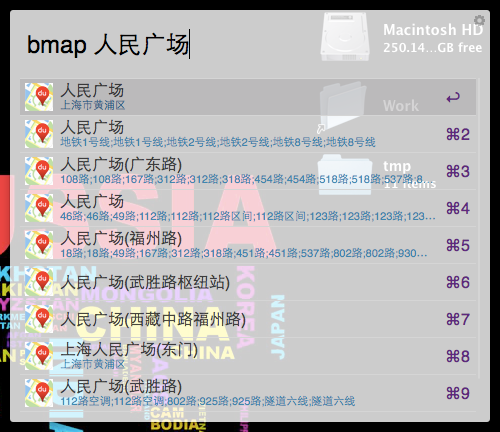
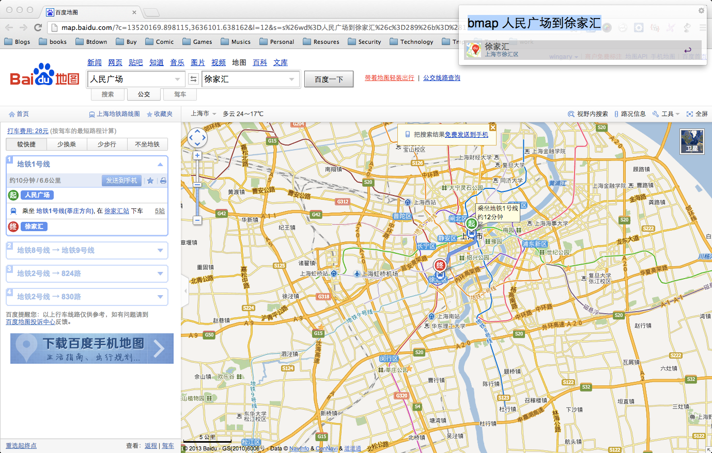

Baidu Map Search
==============

 

通过Alfred搜索百度地图的Workflow。同样欢迎使用我的另一个地图插件[高德地图alfred插件](https://github.com/wofeiwo/alfred-amap)。

使用方法：
- 首先输入"setl"+空格+城市名，设置默认搜索城市地点;
- （可选）输入"bmapak"+空格+你自己的baidu map AK值，避免公用key超过限制。默认使用自带的API ak;
- 输入"bmap"+空格+搜索关键字即可。然后就等他出结果，回车或者cmd+数字就能打开默认浏览器进入地图页面进入地图页面查看搜索结果。

- Tips: 可以直接输入"bmap"+空格+"A到B"或"A去B"，回车后可以直接显示路线图

 

安装：请安装alfred之后，买了alfred的powerpack并激活，下载workflow文件，双击安装即可。 

ChangeLog
==============

- 1.1.1（2016-12-02）： 增加了Baidu Map Accesskey的自定义功能，可以通过bmapak关键词来设置自己的key，避免公用key超过使用限制。
- 1.1.0（2016-11-25）： 修改替换了老旧的AK；确认了V3版本alfred的支持；修复输入内容和搜索结果不匹配的bug。