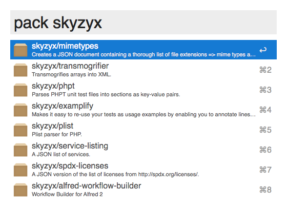

# Alfred 2 workflow for Packagist

**[Download!](https://github.com/skyzyx/packagist.alfredworkflow/raw/master/packagist.alfredworkflow)**
Requires [Alfred 2 and the Powerpack](http://www.alfredapp.com/powerpack/).

Updates can be found and installed using **[Alleyoop](http://alfred.daniel.sh/Workflows/Alleyoop.alfredworkflow)**.
